<div align="center">
  <sub><b>You are here:</b> <a href="../../README.md#readme">Home</a> > <a href="../description.md">assembly</a> > guides > 📄 clion-mips.md</sub>

  <br>
  <h1>Cross-Compile MIPS in CLion: WSL, GCC, and QEMU on Speaking Terms</h1>

  <p>
    <i>Build, run, and debug MIPS assembly from CLion on Windows — cross-compiled in WSL, executed transparently under QEMU, and debugged through gdb-multiarch.</i>
  </p>

  <p>
    
    
    
  </p>

  <!-- tags:start -->
  <p>
    
    
    
    
    
    
  </p>
  <!-- tags:end -->
</div>

<hr>

> *"Sir, your x86 silicon does not speak MIPS. I have engaged a cross-compiler and bribed QEMU to translate in real time — please applaud responsibly."* — J.A.R.V.I.S. (probably)

*Author: Luca Perri · Last updated: 06/05/2026 · Verified against: CLion 2026.1.1*

## Why this guide exists

MIPS is what most of us first met in a computer-architecture lecture: clean five-stage pipeline, fixed-width instructions, the platonic ideal of an ISA for teaching. Then the homework asks you to *actually run* something, your machine is x86, and the wheels come off. SPIM and MARS are fine simulators, but the moment you want a debugger that looks like a real IDE — gutter breakpoints, register watches, a proper build system — you're on your own.

The fix isn't a simulator at all. It's a real cross-compiler (`gcc-mips-linux-gnu`) producing real MIPS ELF binaries, plus QEMU's user-mode emulator transparently running them on x86, all driven by CMake from inside CLion. The trick is that **none of the IDE-level pieces line up by default**: CMake wants to use your host GCC, CLion can't reach into WSL toolchains without coaching, the breakpoint gutter is dead until you teach it about `.s`/`.S` files, and CLion's built-in debugger can't inspect QEMU's emulated memory without a GDB bridge.

This guide walks the five pieces:

1. Installing the **MIPS cross-compiler, QEMU, and gdb-multiarch** inside WSL.
2. Teaching CLion that **`.s` / `.S` are debuggable assembly** so breakpoints actually fire.
3. Saving **file and code templates** that capture the toolchain file, both `CMakeLists.txt` flavours, and the `main.S` skeleton — write them once, reach for them every project after.
4. **Spinning up new MIPS projects** from those templates and wiring up the per-project CMake profile.
5. Setting up **remote debugging** through QEMU's GDB stub and `gdb-multiarch`, so you get full breakpoint, register, and memory inspection inside CLion.

> **Scope:** the templates in Step 3 cover both project flavours — pure bare-metal assembly (your own `__start`, no libc, syscalls direct to the kernel) and C ↔ ASM interop (a C driver calling into hand-written assembly functions over the O32 calling convention). Pick whichever matches the task; the rest of the guide doesn't care.
> Though this guide is specifically written for Windows + WSL, most steps work on Linux too — just strip the Windows-specific paths (`/mnt/c/*`, `\\wsl.localhost\*`) and use your distro paths instead. You'll likely have an easier time of it, since paths resolve directly without the WSL boundary in the way. Also note that depending on your setup (for example if your project already sits in a WSL path) you will have to update/change the paths accordingly.

---

## Prerequisites

- **A working CLion + WSL setup** — see [`clion-wsl-setup.md`](../../wsl/guides/clion-wsl-setup.md). Everything below assumes WSL is wired into CLion and `build-essential` is installed. If you've already worked through [`clion-nasm.md`](./clion-nasm.md), you've done this part — the WSL toolchain setup is the same. If you wish to get the highlighting, installing the NASM plugin too is suggested.
- **Inside WSL**, install the MIPS cross-toolchain, the emulator, the multi-architecture debugger, and the build orchestrators:
  ```bash
  sudo apt update
  sudo apt install gcc-mips-linux-gnu qemu-user gdb-multiarch make ninja-build build-essential
  ```
  | Package | Why |
  | :--- | :--- |
  | `gcc-mips-linux-gnu` | The cross-compiler — produces MIPS ELF objects from the C/ASM driver. Includes the GNU Assembler (`as`) for `.s`/`.S`. |
  | `qemu-user` | User-mode QEMU. Runs MIPS Linux binaries on x86 by translating syscalls. We point CMake at `/usr/bin/qemu-mips`. |
  | `gdb-multiarch` | GDB built with support for every architecture. Required because CLion's bundled WSL GDB only understands x86 — `gdb-multiarch` speaks MIPS and connects to QEMU's GDB stub for remote debugging. |
  | `make`, `ninja-build` | Either backend works — Ninja is faster, Make is the boring default. |
  | `build-essential` | Already pulled in by the WSL guide; listed here in case you skipped it. |

---

## Step 1 — Toolchains

We need **two** WSL toolchains registered in CLion: the standard one for building and running, and a dedicated one that points its debugger at `gdb-multiarch` for remote debug sessions.

Open CLion settings: **☰ menu** (top-left) → **Settings**, or `Ctrl + Alt + S`.


Navigate to **Build, Execution, Deployment → Toolchains**.

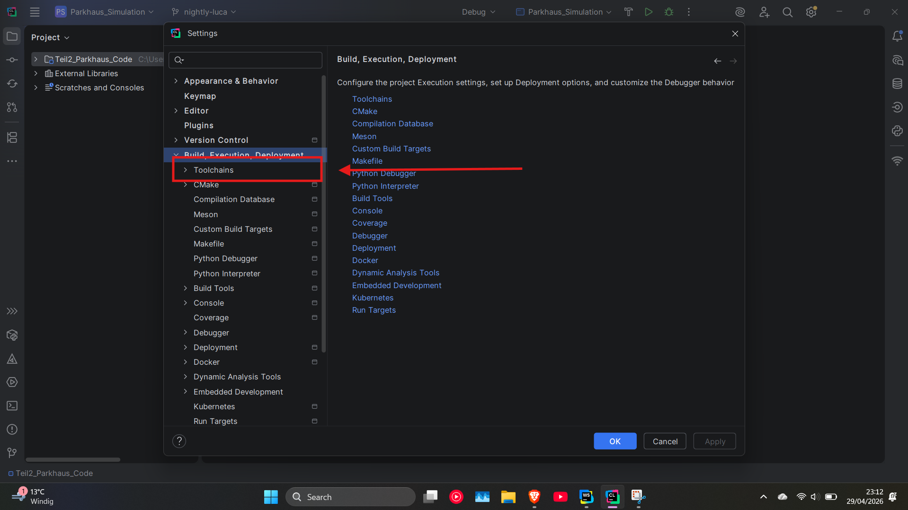

### 1a) WSL build toolchain

Two paths from here:

**Easy path** — verify your existing **WSL** toolchain is listed. The cross-compiler isn't selected here (it's pinned in the toolchain file we'll write in Step 3), so plain `WSL` is enough. (I'm using the NASM one — same toolchain works fine.)

**Custom path** — create a dedicated **WSL MIPS** toolchain if you want to keep MIPS work isolated from your other WSL-side projects (helpful when you have multiple WSL distros, or you're juggling several cross-compile setups). Click **+**, pick **WSL**, and rename it.

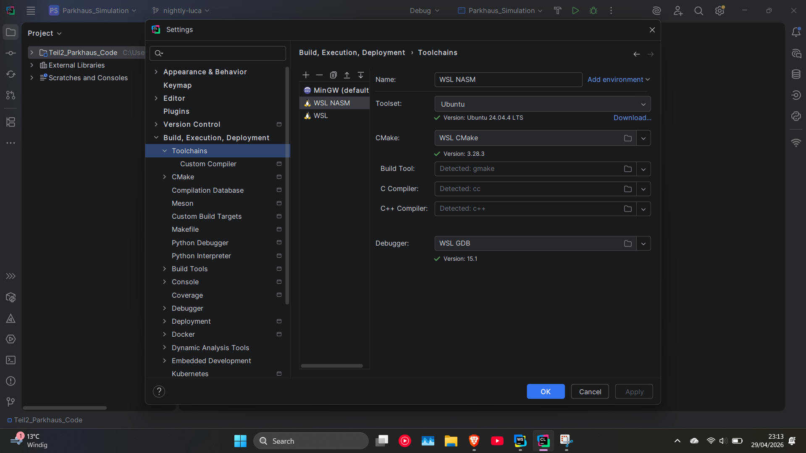

> The MIPS cross-compiler is **not** something you point CLion at directly — CLion's "C/C++ Compiler" field expects a host compiler. We hand the cross-compiler to CMake instead, via the toolchain file template in Step 3.

### 1b) WSL MIPS Debug toolchain

This second toolchain tells CLion to use `gdb-multiarch` as the debugger, which is required for the remote debug workflow in Step 5.

Click **+** → **WSL**, name it `WSL MIPS Debug`. In the **Debugger** field, change it from the default to:

```
/usr/bin/gdb-multiarch
```

Leave everything else (CMake, Build Tool, C/C++ Compiler) at the auto-detected defaults — they won't be used by the Remote Debug configuration.

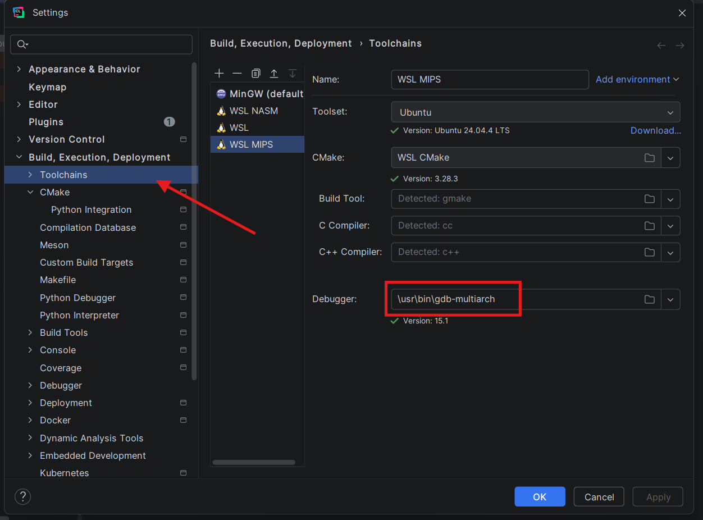

**Apply** before moving on.

---

## Step 2 — Teach CLion that `.s` / `.S` is debuggable assembly

By default CLion treats `.s` (and `.S`) as plain text, which means **the debugger silently ignores gutter breakpoints**. Fix that.

Settings → **Editor → File Types**.

In the **Recognized File Types** list, scroll to **Assembly language file** and add `*.s` to its file-name patterns. (If you also see `*.S` not being recognised, add it explicitly — Windows treats it case-insensitively, but CLion's pattern matching does not.)

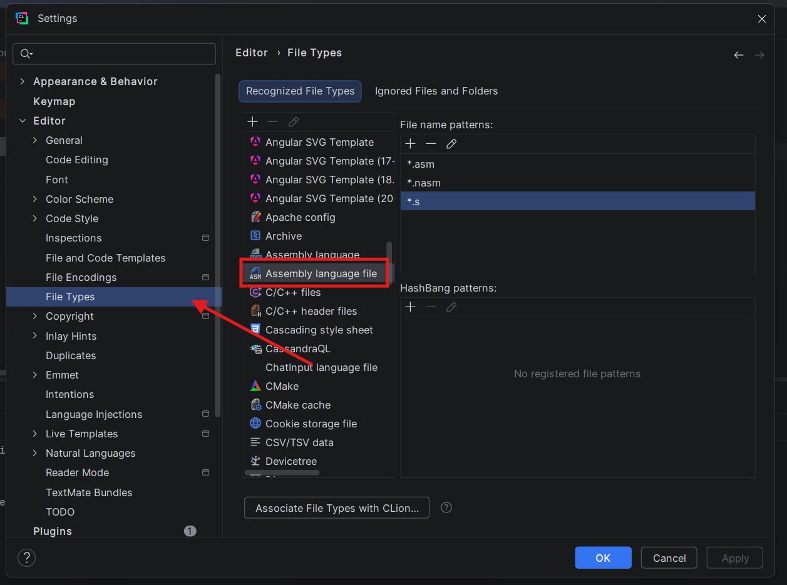

If CLion warns about a conflict with another file type (e.g. `Text`), accept the override — it just means `.s` was previously sitting under plain text.

> If you skip this step, you will not be able to set breakpoints in the gutter.

---

## Step 3 — File and code templates

This guide leans on file and code templates for most of the heavy lifting. Every MIPS project needs the same `mips-toolchain.cmake`, the same `CMakeLists.txt` shape, and the same `main.S` skeleton, so saving them as templates means you only write each one once.

We'll register **four templates** in total: two flavours of `CMakeLists.txt` (one for pure-assembly projects, one for C ↔ ASM interop), the toolchain file, and the `main.S` skeleton. The `CMakeLists.txt` templates also auto-generate the debug toolchain file and QEMU debug wrapper at configure time, so you don't need separate templates for those. After this step you'll have everything you need to scaffold a working MIPS project in under a minute (Step 4).

Open Settings → **Editor → File and Code Templates**, switch to the **Files** tab, and click the **+** button above the template list. CLion uses the same dialog for every entry — only the **Name**, **Extension**, **File name**, and body change — so once you've done the first one, the rest are muscle memory.

### 3a) MIPS `CMakeLists.txt` — C ↔ ASM interop

Reach for this whenever you want C and assembly to call into each other (e.g. a `main.c` driver that hands off to an `asm.S` providing some hand-rolled primitives). Because libc and the C runtime are pulling their weight, we keep `crt0` linked and only force `-static` so QEMU has a self-contained binary to launch.

In the template dialog, set the **Name** field to `MIPS CMakeFile C-InterOp`, the **Extension** to `txt`, and the **File name** to `CMakeLists`. Paste the following into the editor pane and leave **Reformat according to style** ticked so CLion keeps the indentation tidy on instantiation:

```cmake
cmake_minimum_required(VERSION 3.20)

project("${PROJECT_NAME}" C ASM)

# Generate QEMU debug wrapper
file(WRITE "${CMAKE_CURRENT_SOURCE_DIR}/qemu-mips-debug.sh"
     "#!/bin/bash\nexec qemu-mips -g 1234 \"$@\"\n")
file(CHMOD "${CMAKE_CURRENT_SOURCE_DIR}/qemu-mips-debug.sh"
     PERMISSIONS OWNER_READ OWNER_WRITE OWNER_EXECUTE)

# Generate debug toolchain file (mirrors mips-toolchain.cmake with debug emulator)
file(WRITE "${CMAKE_CURRENT_SOURCE_DIR}/mips-toolchain-debug.cmake"
"set(CMAKE_SYSTEM_NAME Linux)
set(CMAKE_SYSTEM_PROCESSOR mips)
set(CMAKE_C_COMPILER   mips-linux-gnu-gcc)
set(CMAKE_CXX_COMPILER mips-linux-gnu-g++)
set(CMAKE_ASM_COMPILER mips-linux-gnu-gcc)
set(CMAKE_ASM_SOURCE_FILE_EXTENSIONS S\;s\;asm)
set(CMAKE_CROSSCOMPILING_EMULATOR \"\${CMAKE_CURRENT_LIST_DIR}/qemu-mips-debug.sh\")
")

add_executable("${PROJECT_NAME}" main.c asm.S)
target_compile_options("${PROJECT_NAME}" PRIVATE -g)
target_link_options("${PROJECT_NAME}" PRIVATE -static)
```

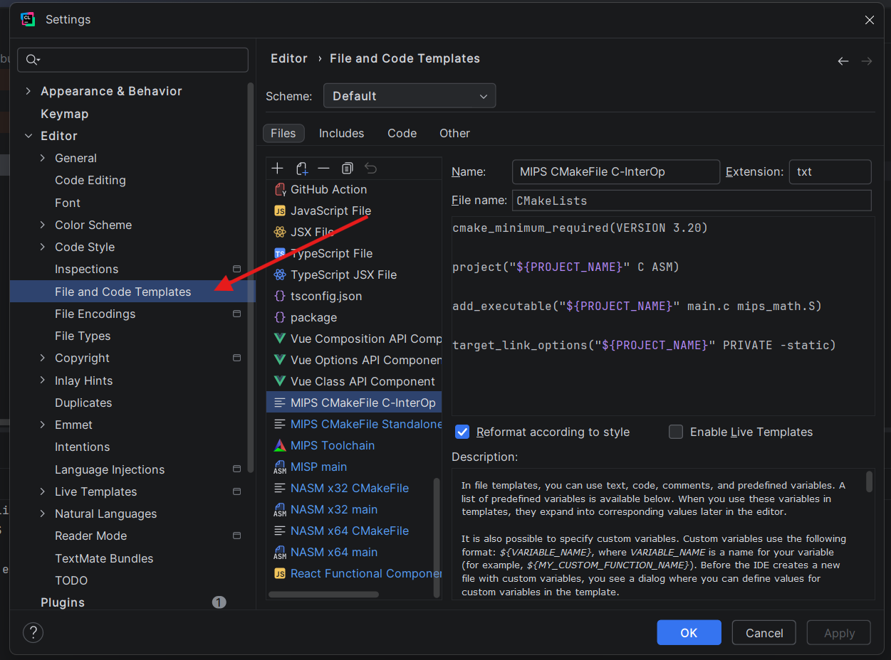

The source list assumes a `main.c` driver alongside an `asm.S` for the assembly side — adjust the names to whatever your convention is, but keep at least one `.c` and one `.S` so CMake leaves both languages enabled. Note what's *not* here: no `-nostdlib`, no `-mno-abicalls`, no custom entry point. The C side needs libc, and your assembly functions are expected to follow the O32 calling convention (`$a0`–`$a3` for arguments, `$v0`/`$v1` for return values) so the C compiler can call into them without ceremony.

The `file(WRITE ...)` blocks at the top auto-generate two files at configure time: `qemu-mips-debug.sh` (a wrapper that launches QEMU with its GDB stub listening on port 1234) and `mips-toolchain-debug.cmake` (a copy of the run toolchain that swaps in the debug wrapper as the emulator). These are used by the debug workflow in Step 5 — you never need to create or manage them by hand.

**Apply** before moving on to the next template.

### 3b) MIPS `CMakeLists.txt` — pure assembly (standalone)

This template is for projects with `.S` sources only — your own `__start`, no libc, syscalls straight to the kernel. The dialog is identical to the one above (CLion reuses the same GUI for every **Files**-tab entry, so the screenshot from the previous step doubles for this one), so this time enter `MIPS CMakeFile Standalone` for the **Name**, leave the **Extension** at `txt` and the **File name** at `CMakeLists`, and paste:

```cmake
cmake_minimum_required(VERSION 3.20)

project("${PROJECT_NAME}" C ASM)

# Generate QEMU debug wrapper
file(WRITE "${CMAKE_CURRENT_SOURCE_DIR}/qemu-mips-debug.sh"
     "#!/bin/bash\nexec qemu-mips -g 1234 \"$@\"\n")
file(CHMOD "${CMAKE_CURRENT_SOURCE_DIR}/qemu-mips-debug.sh"
     PERMISSIONS OWNER_READ OWNER_WRITE OWNER_EXECUTE)

# Generate debug toolchain file (mirrors mips-toolchain.cmake with debug emulator)
file(WRITE "${CMAKE_CURRENT_SOURCE_DIR}/mips-toolchain-debug.cmake"
"set(CMAKE_SYSTEM_NAME Linux)
set(CMAKE_SYSTEM_PROCESSOR mips)
set(CMAKE_C_COMPILER   mips-linux-gnu-gcc)
set(CMAKE_CXX_COMPILER mips-linux-gnu-g++)
set(CMAKE_ASM_COMPILER mips-linux-gnu-gcc)
set(CMAKE_ASM_SOURCE_FILE_EXTENSIONS S\;s\;asm)
set(CMAKE_CROSSCOMPILING_EMULATOR \"\${CMAKE_CURRENT_LIST_DIR}/qemu-mips-debug.sh\")
")

add_executable("${PROJECT_NAME}" main.S)
target_compile_options("${PROJECT_NAME}" PRIVATE -g -mno-abicalls -fno-pic)
target_link_options("${PROJECT_NAME}" PRIVATE
        -static -nostdlib -mno-abicalls -fno-pic -Wl,-e,__start)
```

The flag set is the load-bearing difference between this template and the C-InterOp one: `-nostdlib` keeps `crt0` and libc out of the link, `-mno-abicalls -fno-pic` tell both the assembler and the linker that we don't have a global pointer to play with, and `-Wl,-e,__start` overrides the linker's default search for `_start` so it finds the entry label we actually defined. The `-g` flag is critical — without it, GDB can't map addresses back to source lines during debugging.

> **Why no spaces in the project name?** CMake's `project()` and target-name handling won't tolerate spaces under Linux/WSL builds at all — `project(MIPS Playground ...)` may parse on Windows but breaks the moment the same `CMakeLists.txt` runs through your cross-build. Use underscores in the project name itself (`MIPS_Playground`, not `MIPS Playground`).

> **Why quote `${PROJECT_NAME}`?** Even with an underscore-only project name, CMake crashes with confusing errors when your repo's *path* contains spaces (`C:\My Documents\code\...`). Quoting `${PROJECT_NAME}` everywhere is a one-line insurance policy that covers the path case.

**Apply**.

### 3c) MIPS toolchain-file template

Same dialog, fresh template. Enter `MIPS Toolchain` for the **Name**, set the **Extension** to `cmake`, and the **File name** to `mips-toolchain`. Paste the body:

```cmake
# 1. Target architecture
set(CMAKE_SYSTEM_NAME Linux)
set(CMAKE_SYSTEM_PROCESSOR mips)

# 2. Pin the MIPS cross-compilers
set(CMAKE_C_COMPILER   mips-linux-gnu-gcc)
set(CMAKE_CXX_COMPILER mips-linux-gnu-g++)
set(CMAKE_ASM_COMPILER mips-linux-gnu-gcc)

# 3. Drive GAS through the C compiler frontend
set(CMAKE_ASM_SOURCE_FILE_EXTENSIONS S;s;asm)

# 4. Auto-run the resulting binary under QEMU
set(CMAKE_CROSSCOMPILING_EMULATOR /usr/bin/qemu-mips)
```

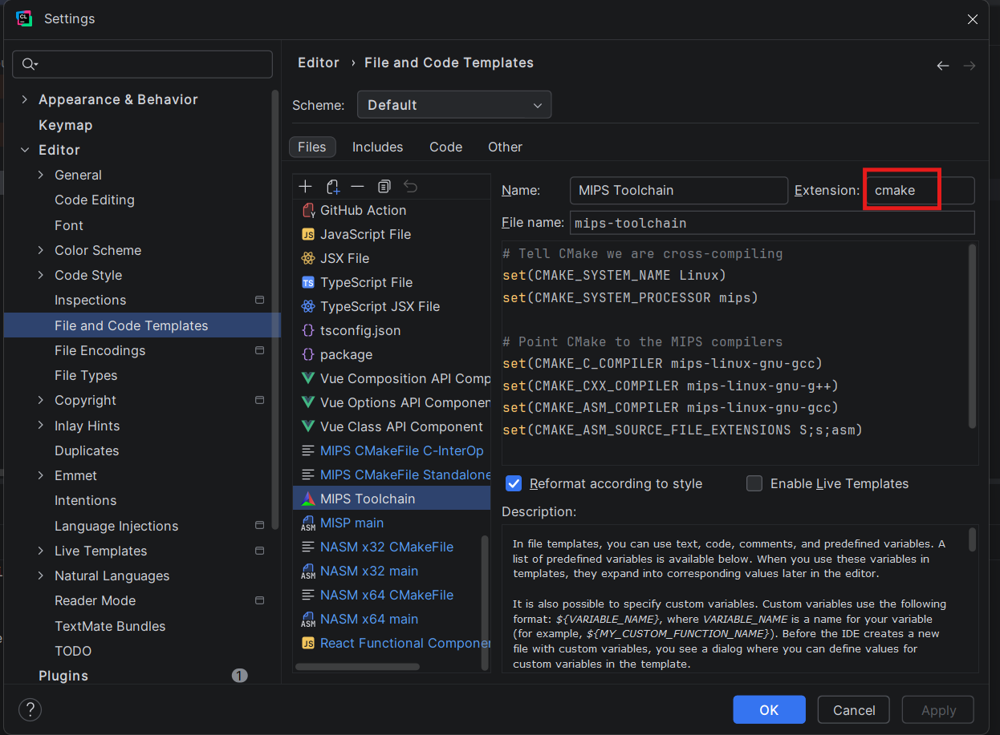

The `cmake` extension matters — that's how the per-project CMake profile in Step 4 finds the file via `$CMakeCurrentSourceDir$/mips-toolchain.cmake`.

<details>
<summary><b>What does each block actually do?</b> (click to expand)</summary>

| Block | What it does |
| :--- | :--- |
| `CMAKE_SYSTEM_NAME` / `_PROCESSOR` | Flips CMake into cross-compile mode. Without these, CMake assumes target == host, runs host introspection (`try_run`, etc.) against your x86 toolchain, and silently miscompiles. |
| `CMAKE_*_COMPILER` | Pins the actual binaries. The `mips-linux-gnu-` triplet is what the Debian package installs as. Setting `CMAKE_ASM_COMPILER` to *gcc* (not `as`) lets the C preprocessor run on `.S` files — the convention `.S` = preprocessed, `.s` = raw. |
| `CMAKE_ASM_SOURCE_FILE_EXTENSIONS` | Tells CMake which extensions count as assembly sources for the ASM language. Default is `s;asm`; we add capital `S` so `main.S` is picked up. |
| `CMAKE_CROSSCOMPILING_EMULATOR` | The tidy bit. CMake transparently prefixes any `Run` of the target with this command, so hitting the green play button in CLion runs `qemu-mips ./your-binary` instead of trying to launch a MIPS ELF natively (which would fail with `Exec format error`). |

</details>

**Apply**.

### 3d) MIPS `main.S` template

Last one. Enter `MIPS main` for the **Name**, type a capital `S` into the **Extension** field, and `main` into the **File name** field. The capitalisation matters: `S` (uppercase) is what we registered in `CMAKE_ASM_SOURCE_FILE_EXTENSIONS`, and it's the convention GCC uses to mean "run this through the C preprocessor before assembling" — so you can `#include` and `#define` inside the file. A lowercase `.s` would also build, but it bypasses the preprocessor and the new file wouldn't pick up the same template metadata.

For the body, paste a complete bare-metal "Hello, World!" — O32 ABI, syscall IDs in `$v0` offset by `4000` (so `sys_write` = `4004`, `sys_exit` = `4001`), arguments in `$a0`–`$a3`:

```asm
    .data
hello_msg:
    .asciiz "Hello, World! The MIPS pipeline is fully operational.\n"
    .equ hello_len, . - hello_msg

    .text
    .globl __start
    .ent __start

__start:
    # sys_write(stdout, msg, len)
    li   $v0, 4004        # syscall ID for sys_write on MIPS O32
    li   $a0, 1           # fd = stdout
    la   $a1, hello_msg
    li   $a2, hello_len
    syscall

    # sys_exit(0)
    li   $v0, 4001        # syscall ID for sys_exit on MIPS O32
    move $a0, $zero
    syscall

    .end __start
```

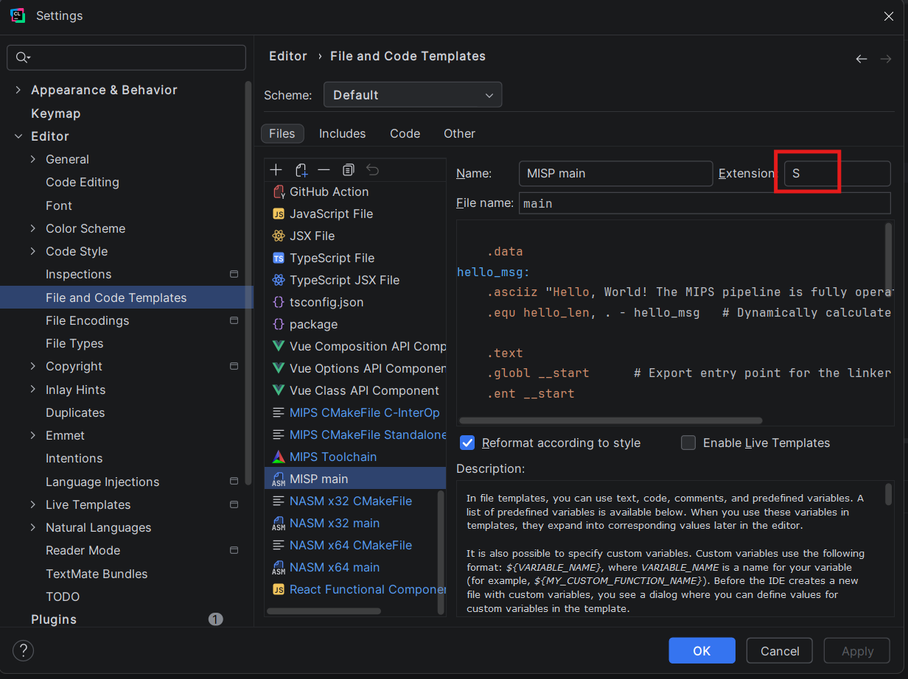

Feel free to strip the body down to just the `__start` skeleton with the `sys_exit` call if you'd rather start every new project from a blank slate than have the "Hello, World!" text already wired up.

**Apply** → **OK** to close Settings.

---

## Step 4 — Spinning up your first MIPS project

CLion's New Project wizard always lands you in a plain **C Executable** project — it doesn't know about your shiny new MIPS templates yet. The workflow for any new MIPS project is therefore: scaffold a C Executable, throw out what CLion generates, and rebuild it from the templates you just registered.

### 4.1 — Create an empty C Executable

`File → New Project → C Executable`. Pick a name (we'll use `MIPS_Playground` for the rest of this section — see the "[Why the quoting](#3b-mips-cmakeliststxt--pure-assembly-standalone)" callout in template 3b for why no spaces), accept the defaults, and let CLion generate the boilerplate.

### 4.2 — Delete the auto-generated files

Right-click the auto-generated `main.c` and `CMakeLists.txt` in the project tree → **Delete**. CLion will whine about the missing `CMakeLists.txt`; ignore it for now — we're about to put one back.

### 4.3 — Scaffold from the MIPS templates

Right-click the project root → **New** (or `File → New`). Scroll past the built-in entries — your four MIPS templates sit at the bottom of the list.

For a pure-assembly project, pick:

- **MIPS CMakeFile Standalone** → produces `CMakeLists.txt`
- **MIPS Toolchain** → produces `mips-toolchain.cmake`
- **MIPS main** → produces `main.S`

For a C ↔ ASM interop project, swap the first one for **MIPS CMakeFile C-InterOp** and create your own `main.c` (CLion's built-in `C File` template will do), plus an `asm.S` from the **MIPS main** template renamed to match the source list in the InterOp `CMakeLists.txt`.

### 4.4 — Wire up the CMake profile

Templates handle the files; CMake profiles are project-local and need to be set up by hand each time. The catch: `mips-toolchain.cmake` lives on the Windows filesystem, but CMake is invoked from inside WSL, so a literal Windows path won't resolve. CLion ships a macro that handles the translation.

Settings → **Build, Execution, Deployment → CMake**. Click **+** to add a new profile.

- **Name:** `MIPS Debug`
- **Toolchain:** `WSL` (or your `WSL MIPS` from Step 1a)
- **CMake options:**
  ```text
  -DCMAKE_TOOLCHAIN_FILE=$CMakeCurrentSourceDir$/mips-toolchain.cmake
  ```

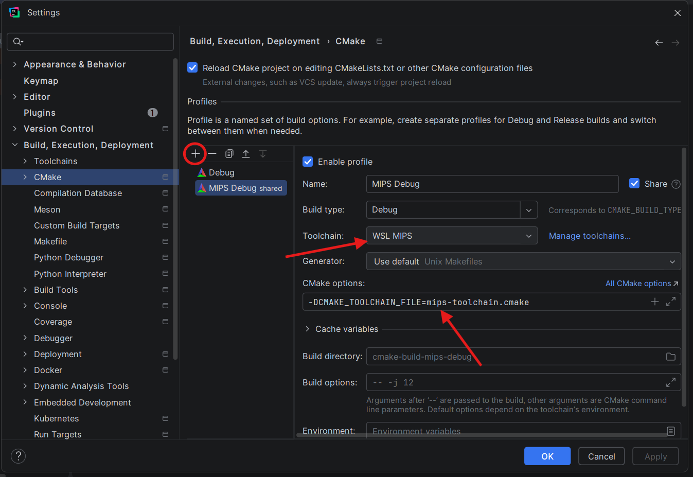

**Apply** → **OK**, and make sure `MIPS Debug` is selected in the profile dropdown at the top right of CLion.

> **Why the macro?** Hard-coding `C:\Users\you\...` works on your machine and breaks on everyone else's. `$CMakeCurrentSourceDir$` is evaluated by CLion at configure time and gets translated through the WSL mount, so the toolchain file resolves the same way on any contributor's box.

### 4.5 — Build & run

With the `MIPS Debug` profile selected and your project name as the target, hit the green ▶ button. CLion builds the ELF, CMake notices `CMAKE_CROSSCOMPILING_EMULATOR` is set, and your output appears in the Run pane:

```
Hello, World! The MIPS pipeline is fully operational.

Process finished with exit code 0
```

If the binary built but won't run, jump to **Known issues** below — it's almost always one of three things.

---

## Step 5 — Remote debugging with QEMU and gdb-multiarch

CLion's built-in debugger can't inspect QEMU's emulated MIPS memory directly. The workaround is QEMU's GDB stub: launch QEMU with a `-g <port>` flag so it halts before executing any instructions and waits for a GDB connection. Then CLion's **Remote Debug** configuration connects `gdb-multiarch` to that port, and you get full breakpoint, register, and memory inspection — the same debugging experience you'd expect from a native build.

The plumbing has three parts: a Shell Script that starts QEMU in the background with the GDB stub active, a Remote Debug run configuration that attaches `gdb-multiarch`, and a Before Launch task that chains the two together so debugging is a single click.

### 5.1 — How the debug files are generated

You don't need to create any new files by hand. The `CMakeLists.txt` templates from Step 3 already contain `file(WRITE ...)` blocks that auto-generate two files at configure time:

| Generated file | What it does |
| :--- | :--- |
| `qemu-mips-debug.sh` | A one-line wrapper that runs `qemu-mips -g 1234 "$@"` — launches QEMU with its GDB stub listening on port 1234 and forwards whatever binary CMake passes in. |
| `mips-toolchain-debug.cmake` | A copy of `mips-toolchain.cmake` with `CMAKE_CROSSCOMPILING_EMULATOR` pointed at the debug wrapper instead of plain `qemu-mips`. |

The `file(CHMOD ...)` call sets the executable bit on `qemu-mips-debug.sh` automatically, so there's no manual `chmod` step. Both files land in the project root alongside your source files.

If you haven't built the project yet with the `MIPS Debug` profile, do so now — the configure step is what triggers the file generation.

### 5.2 — Create the QEMU launcher Shell Script

We need a Shell Script run configuration that starts QEMU in the background with the GDB stub active. QEMU must keep running after the script returns, so we use `nohup` and `&` to detach it from the parent shell.

**Run → Edit Configurations → + → Shell Script**. Fill in:

- **Name:** `QEMU Start Script`
- **Execute:** select **Script text**
- **Script text:**
  ```
  wsl bash -c "cd '/path/to/your/project' && nohup qemu-mips -g 1234 cmake-build-mips-debug/<your-binary> > /dev/null 2>&1 & sleep 1 && ss -tlnp | grep 1234"
  ```

Adjust `/path/to/your/project` to wherever your project lives inside WSL, and `<your-binary>` to the executable name in `cmake-build-mips-debug/` after the first build (it'll be your CLion project's name, with spaces auto-converted by CMake). The binary path must match your CMake profile's build directory and target name.

**Standard Windows + WSL setup** (CLion's default project location):
```
wsl bash -c "cd '/mnt/c/Users/<your-username>/CLionProjects/<your-project>' && nohup qemu-mips -g 1234 cmake-build-mips-debug/<your-binary> > /dev/null 2>&1 & sleep 1 && ss -tlnp | grep 1234"
```

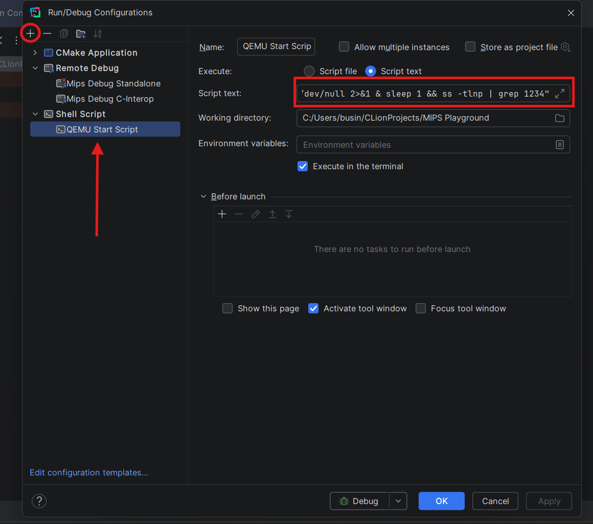
> Note that `<your-binary>` will in most cases be your project name, as it's defined by the project name in `CMakeLists.txt`. If your project's name is `MIPS_Playground`, the binary will be that. You can find it by looking into the build folder for the file with no extension.

<details>
<summary><b>Why nohup, &, sleep, and the ss check?</b> (click to expand)</summary>

The `&` backgrounds QEMU so `bash` returns immediately — otherwise the Before Launch task would hang forever waiting for QEMU to exit (which it never does, because it's waiting for GDB). But WSL terminates all child processes when the parent shell exits, so `&` alone isn't enough. `nohup` detaches QEMU from the shell's process group so it survives the shell closing. The `sleep 1` gives QEMU a moment to bind port 1234 before GDB tries to connect. The trailing `ss -tlnp | grep 1234` is a sanity check — it prints any TCP listener on port 1234, so the run pane shows you a confirmation line when QEMU bound the port successfully. If the line is empty, QEMU died silently (bad binary path, port collision, etc.) and you know to fix it before GDB throws a misleading connection error.

</details>

**Apply**.

### 5.3 — Create the Remote Debug configuration

**Run → Edit Configurations → + → Remote Debug**. Fill in:

- **Name:** `MIPS Debug Standalone` (or `MIPS Debug C-Interop` for interop projects)
- **Debugger:** select **WSL GDB from 'WSL MIPS Debug' toolchain** from the dropdown
- **'target remote' args:** `localhost:1234`
- **Symbol file:** the WSL path to your built ELF — adjust to wherever your project lives:
  ```
  /path/to/your/project/cmake-build-mips-debug/<your-binary>
  ```
  Standard Windows + WSL setup:
  ```
  /mnt/c/Users/<your-username>/CLionProjects/<your-project>/cmake-build-mips-debug/<your-binary> 
  ```
  > Note that <your-binary> will in most cases be your project name, as it's defined by the project name in CMakeLists.txt
- **Sysroot:** leave blank for **Standalone** projects (`-nostdlib` means there's nothing for GDB to resolve). For **C-Interop** projects, point it at your MIPS sysroot so GDB can pull libc symbols and step through C runtime code:
  ```
  /usr/mips-linux-gnu
  ```
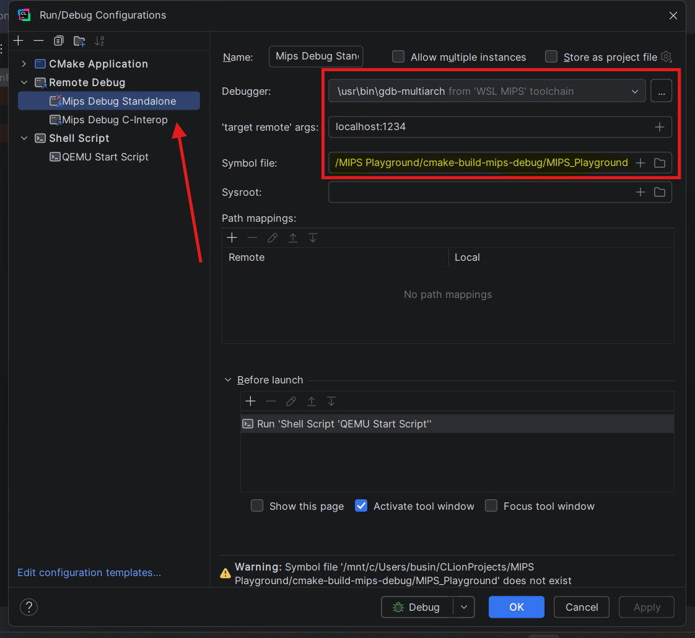

> **Why the Linux path for the symbol file?** The debugger runs inside WSL (via the `WSL MIPS Debug` toolchain), so it needs a path it can resolve — `/mnt/c/...`, not `C:\...` or `\\wsl.localhost\...`.

> **Note:** The CLion GUI won't resolve a WSL path correctly and will show a warning along the lines of "file not found". That's expected — just a GUI quirk; on Run, the path is resolved by your WSL runtime and the warning goes away.

### 5.4 — Wire up the Before Launch task

Still in the Remote Debug configuration, scroll down to **Before launch** and click **+** → **Run Another Configuration** → select **QEMU Start Script**.

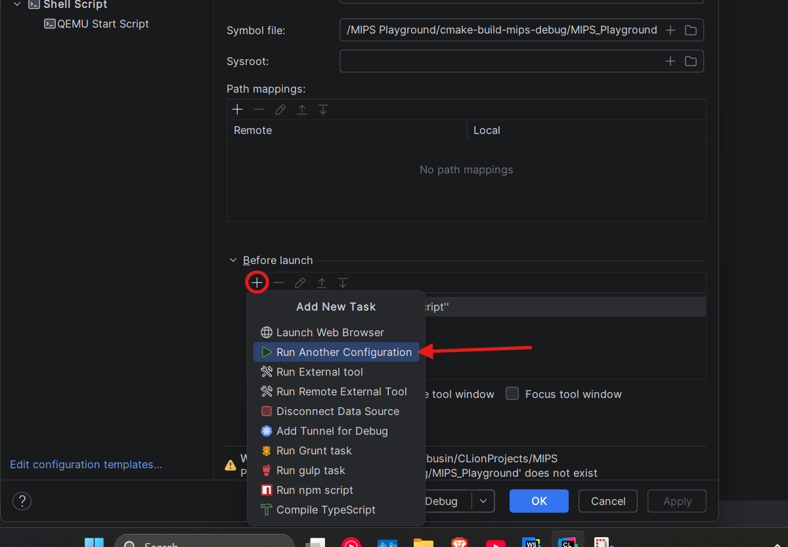

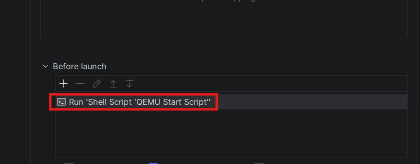

This chains the workflow: when you launch `MIPS Debug Standalone`, CLion first runs the shell script (which starts QEMU in the background and returns immediately), then connects `gdb-multiarch` to port 1234.

**Apply** → **OK**.

### 5.5 — Debug!

Set a breakpoint on an instruction line under `.text` in your `main.S` (click the gutter). Select `MIPS Debug Standalone` from the run configuration dropdown and hit the **Debug** button (the bug icon, or `Shift + F9`).

CLion will:

1. Run the shell script → QEMU starts in the background, GDB stub listens on port 1234
2. Launch `gdb-multiarch` → connects to `localhost:1234`
3. Hit your breakpoint → the debugger pane opens with register values, memory view, and source-level stepping

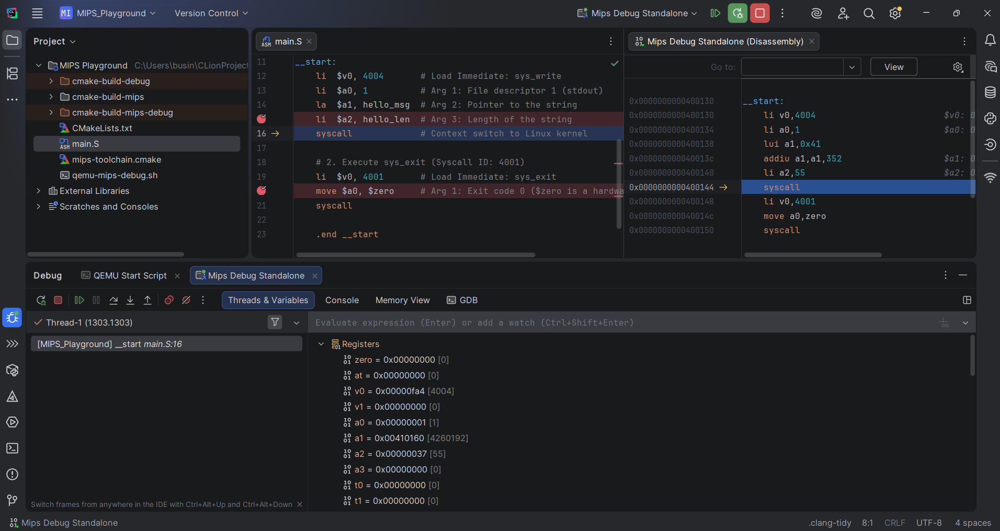

From here you have the full GDB feature set: **Step Over** (`F8`), **Step Into** (`F7`), **Evaluate Expression**, **Memory View**, and **Register Watch**. For the C ↔ ASM interop template, `gdb-multiarch` steps through both C and assembly seamlessly — no extra configuration needed.

---

## Day-to-day notes

- **Pick the right run configuration** before hitting Run or Debug. The dropdown to the left of the Play button switches between your CMake target (normal execution under the `MIPS Debug` profile) and the `MIPS Debug Standalone` / `MIPS Debug C-Interop` Remote Debug configs (debug with GDB). Mixing them produces the most confusing error messages in the catalogue.
- **Port 1234 is arbitrary** — pick any free port, just keep it consistent between `qemu-mips-debug.sh`, the shell script, and the Remote Debug config's `target remote` args.
- **`$gp` is unset** in standalone projects — that's the whole point of `-mno-abicalls -fno-pic`. The moment you switch to the C-InterOp template, libc's runtime initialises the global pointer for you and those flags drop away (which is why the InterOp template doesn't carry them).
- **QEMU user-mode is not full-system emulation.** Syscalls are translated to host syscalls; you don't get a MIPS kernel, MMU, or interrupt controller. That's fine for userland assembly — anything that touches privileged instructions (CP0, eret, etc.) won't work here.
- **Switching to `.s` lowercase** disables the C preprocessor for that file. Useful if you're pasting code from a textbook that happens to contain `#` comments meant as line comments rather than preprocessor directives.
- **Breakpoints on `.data` lines won't fire** — they must be on instruction lines under `.text`. If a breakpoint shows as "set but never hit", check its location.
- **The debug session cleans up after itself** — CLion terminates QEMU when the debug session ends, so you don't normally need to worry about stale processes holding port 1234. If you do hit a "port already in use" error, kill any lingering QEMU with `wsl pkill -f 'qemu-mips -g 1234'`.

---

## Known issues & caveats

- **`Exec format error` when running** — you didn't add `*.s` to the Assembly language file type, *or* the `CMAKE_CROSSCOMPILING_EMULATOR` line didn't make it into the toolchain file. CLion is trying to launch the MIPS ELF natively. Re-check Step 2 and template 3c.
- **`undefined reference to '_start'`** — the linker is looking for the standard entry point but you defined `__start`. Either rename your label or keep `-Wl,-e,__start` in the link flags. Don't mix the two. (Only applies to the Standalone template; the InterOp build uses libc's `_start` and you should leave it alone.)
- **`cannot find -lc` / `crt1.o: No such file`** — `-nostdlib` got dropped from the link options on a Standalone build. Without it, the linker tries to pull in libc and the C runtime, and the bare-metal flags conflict.
- **CMake configure step fails on a path with spaces** (e.g. `C:\My Documents\...`) — make sure `${PROJECT_NAME}` is **quoted** in `CMakeLists.txt`. Unquoted, CMake parses the space as an argument boundary.
- **Breakpoints set but never fire** — Step 2 was skipped, or the breakpoint is on a `.data` line. Move it onto an instruction line under `.text`.
- **`qemu-mips: command not found`** during run — `qemu-user` wasn't installed, or it landed at a different path on your distro. Run `which qemu-mips` inside WSL and update `CMAKE_CROSSCOMPILING_EMULATOR` accordingly.
- **`could not connect: Connection refused`** during debug — QEMU isn't running or didn't bind the port in time. Verify the shell script path matches your project, and that the binary name in the script matches your CMake target. Try increasing `sleep 1` to `sleep 2` in the shell script if the connection is intermittent.
- **`could not connect: Connection timed out`** during debug — QEMU started and exited before GDB connected. This usually means the shell script is running the binary with the regular `mips-toolchain.cmake` (which uses plain `qemu-mips` without `-g`). Make sure the shell script calls `qemu-mips -g 1234` directly, not through CMake.
- **`Cannot access memory at address 0x...`** — GDB connected before QEMU finished setting up emulated memory. Add `sleep 1` or `sleep 2` to the shell script after the `&`.
- **Debugger exits with SIGABRT (exit code 134)** — usually a timing issue. Ensure the Before Launch shell script completes before GDB tries to connect. The `nohup ... & sleep 1` pattern handles this — if you're seeing SIGABRT, the sleep might not be long enough, or QEMU isn't binding the port.

---

## Useful links

**Cross-compilation & emulation**
- [CMake `CMAKE_CROSSCOMPILING_EMULATOR` docs](https://cmake.org/cmake/help/latest/variable/CMAKE_CROSSCOMPILING_EMULATOR.html) — how CMake hooks into QEMU natively, and where else this variable shows up (CTest, `try_run`, etc.).
- [CMake cross-compiling guide](https://cmake.org/cmake/help/latest/manual/cmake-toolchains.7.html#cross-compiling) — the canonical reference for writing toolchain files.
- [QEMU user-mode documentation](https://www.qemu.org/docs/master/user/main.html) — what user-mode emulation can and can't do; useful when you start hitting its limits.

**Debugging**
- [QEMU GDB usage](https://www.qemu.org/docs/master/system/gdb.html) — how QEMU's GDB stub works, including multi-architecture and user-mode specifics.
- [GDB Remote Debugging](https://sourceware.org/gdb/current/onlinedocs/gdb.html/Remote-Debugging.html) — the GDB manual's chapter on `target remote`, which is the protocol CLion's Remote Debug configuration drives under the hood.

**MIPS reference**
- [Linux MIPS O32 syscall table](https://syscalls.w3challs.com/?arch=mips_o32) — primary reference for syscall numbers and register conventions.
- [System V ABI — MIPS Processor Supplement](https://refspecs.linuxfoundation.org/elf/mipsabi.pdf) — definitive whitepaper explaining *why* `-mno-abicalls` and `-fno-pic` are required when `$gp` isn't initialised by a C runtime.
- [MIPS Instruction Reference (Wikibooks)](https://en.wikibooks.org/wiki/MIPS_Assembly) — gentle, readable, free.
- [SPIM / MARS reference card](https://www.cs.unibo.it/~solmi/teaching/arch_2002-2003/AssemblyLanguageProgDoc.pdf) — the syntax you probably learned in class. Most of it carries over to GAS verbatim.

**Toolchain**
- [Debian `gcc-mips-linux-gnu` package](https://packages.debian.org/stable/gcc-mips-linux-gnu) — what's actually inside the cross-compiler package, including the `binutils` it pulls in.

---

<div align="center">
  <sub>Found a step that drifted out of date? Open a PR — see the <a href="../../README.md#contributions">root README</a>.</sub>
</div>