<div align="center">
  <sub><b>You are here:</b> <a href="../../README.md#readme">Home</a> > <a href="../description.md">assembly</a> > guides > 📄 clion-nasm.md</sub>

  <br>
  <h1>Assemble in CLion: NASM Without the Headaches</h1>

  <p>
    <i>Write, build, and debug NASM assembly inside CLion using your WSL toolchain.</i>
  </p>

  <p>
    
    
    
  </p>

  <!-- tags:start -->
  <p>
    
    
    
    
  </p>
  <!-- tags:end -->
</div>

<hr>

> *"Sir, you are now writing instructions the CPU executes literally. I have configured the registers; the typos are your responsibility."* — J.A.R.V.I.S. (probably)

*Author: Luca Perri · Last updated: 29/04/2026 · Verified against: CLion 2026.1.1*

## Why this guide exists

NASM-on-Windows-via-CLion is one of those "lecturer's slides make it look easy" stacks that breaks the moment you actually try it. MinGW doesn't speak ELF, the syntax-highlighting plugin landscape is a graveyard, and CLion's debugger flat-out refuses to set breakpoints in `.asm` files until you sweet-talk it into recognizing the extension. None of this is documented in one place.

This guide walks through the four pieces:

1. Verifying (or creating) a NASM-friendly **WSL toolchain** in CLion.
2. Teaching CLion that `.asm` and `.nasm` are **debuggable** assembly files.
3. Setting up **file-and-code templates** for both 32-bit and 64-bit projects.
4. Making the **debugger** actually show registers.

> **Scope:** this is the **pure-ASM** flavor — programs built entirely from `.asm` files that talk to the kernel directly via syscalls. If you want to call NASM functions from C/C++ (or call C from your assembly), see [`clion-nasm-c-interop.md`](./clion-nasm-c-interop.md) *(coming soon — different CMake setup, libc linkage, System V calling convention).*

---

## Prerequisites

- **A working CLion + WSL setup** — see [`clion-wsl-setup.md`](../../wsl/guides/clion-wsl-setup.md). Everything below assumes WSL is already wired into CLion.
- **Inside WSL**, install NASM and the 32-bit GCC support library:
  ```bash
  sudo apt install nasm gcc-multilib
  ```
  `nasm` is the assembler; `gcc-multilib` lets you link 32-bit ELF binaries on a 64-bit Ubuntu host. Skip `gcc-multilib` and the x32 template below silently fails at link time with cryptic errors about missing 32-bit crt files.
- **NASM Assembly Language plugin** by Aidan Khoury — install from inside CLion (Settings → Plugins → Marketplace → search "NASM Assembly Language"). The plugin's marketplace page is at <https://plugins.jetbrains.com/plugin/9759-nasm-assembly-language>.

> ⚠ **Attention when adding "Enhanced NASM Assembly Support" plugin by `aahron`** — it consistently crashes CLion 2026.1.1 in my testing. The Aidan Khoury plugin is the one you need at minimum.

---

## Step 1 — Toolchain

Open CLion settings: **☰ menu** (top-left) → **Settings**, or `Ctrl + Alt + S`.

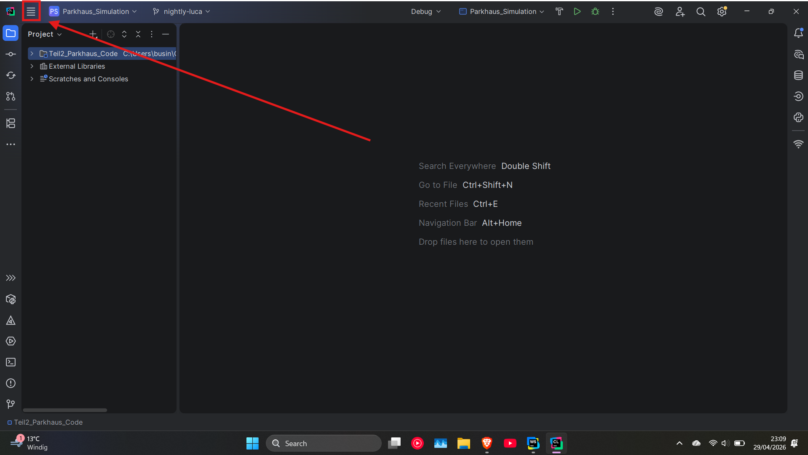

Navigate to **Build, Execution, Deployment → Toolchains**.


Two paths from here:

**a) Easy path** — verify your existing **WSL** toolchain is listed. If it is and you don't need NASM-specific build flags, you're done with the toolchain step.

**b) Custom path** — create a dedicated **NASM WSL** toolchain (useful if you want to pin custom build/link commands without polluting your main WSL toolchain). Click **+**, pick **WSL**, and rename it.


### CMake profile (per-project toolchain)

If you'd rather not make WSL the global default, attach it on a per-project basis through a CMake profile.

Settings → **Build, Execution, Deployment → CMake**. Click **+** to add a new profile.

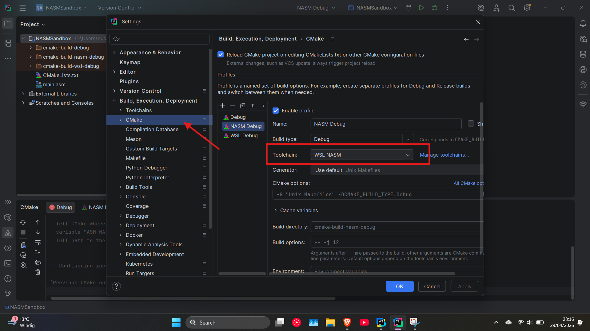

- **Toolchain:** select your `NASM WSL` (or plain `WSL`).
- **CMake options:** leave blank for now — flag tweaks for Release/Debug live here.

**Apply**.

---

## Step 2 — Teach CLion that `.asm` is debuggable assembly

By default CLion treats `.asm` and `.nasm` as plain text, which means **the debugger cannot set breakpoints in them**. Fix that.

Settings → **Editor → File Types**.

**2.1.** Scroll to **Text** in the recognized-types list. If `*.asm` or `*.nasm` are listed there, **remove them**.

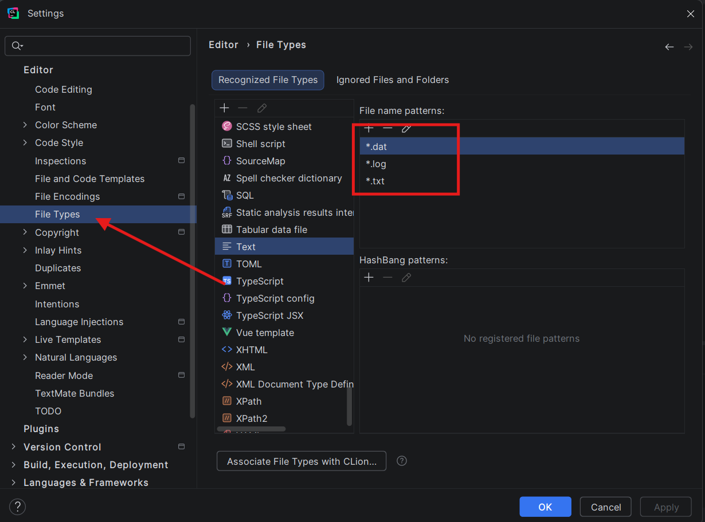

**2.2.** Scroll to **Assembly Language File** and add both extensions: `*.asm` and `*.nasm`. If CLion warns about a conflict, accept the override.

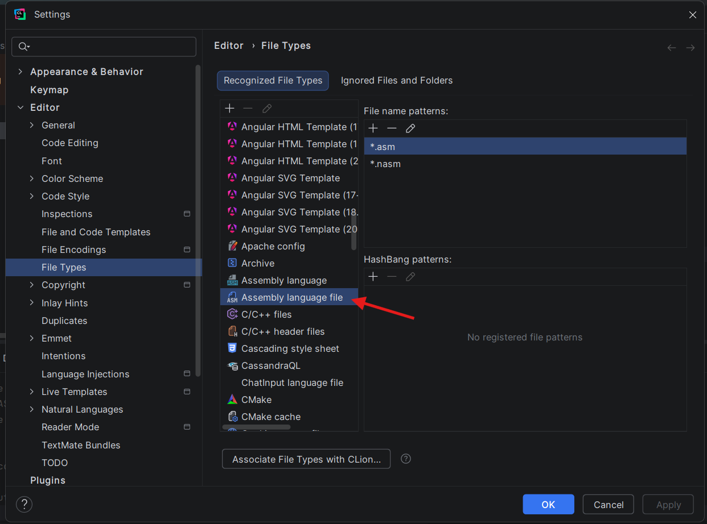

> Skip this step and you'll be stuck setting breakpoints with `int3` instructions inline in your assembly. Doable, but miserable.

---

## Step 3 — File and code templates

Set these up once and you'll never copy-paste boilerplate again. We'll create four templates total: a CMakeLists for x32, one for x64, and a `main.asm` for each.

Settings → **Editor → File and Code Templates**. Make sure the **Files** tab is selected.

### 3.1 — CMakeLists templates

Click **+** to create a new template.

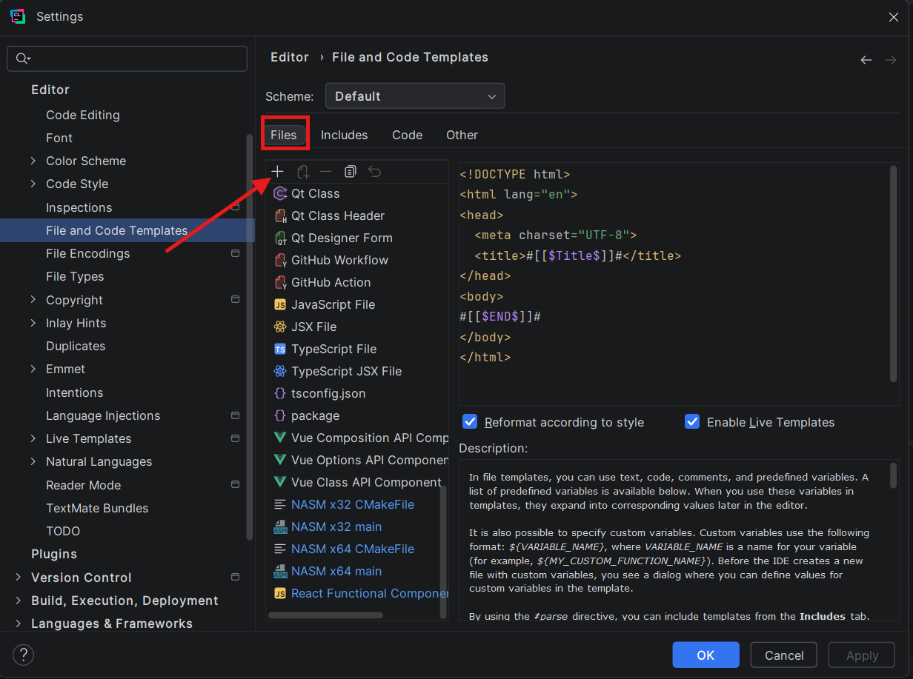

Fill in:

- **Name:** `NASM 32 CMakeFile` (or `NASM 64 CMakeFile`).
- **Extension:** `txt`.
- **File name:** `CMakeLists`.

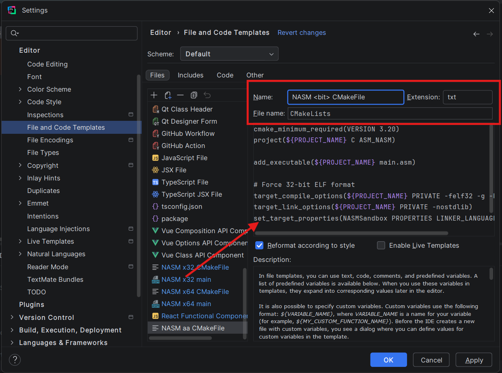

Paste the matching body:

**32-bit:**
```cmake
cmake_minimum_required(VERSION 3.20)
project(${PROJECT_NAME} C ASM_NASM)

add_executable(${PROJECT_NAME} main.asm)

# Force 32-bit ELF format
target_compile_options(${PROJECT_NAME} PRIVATE -felf32 -g -Fdwarf)
target_link_options(${PROJECT_NAME} PRIVATE -nostdlib)
set_target_properties(${PROJECT_NAME} PROPERTIES LINKER_LANGUAGE C)
```

**64-bit:**
```cmake
cmake_minimum_required(VERSION 3.20)
project(${PROJECT_NAME} C ASM_NASM)

add_executable(${PROJECT_NAME} main.asm)

target_compile_options(${PROJECT_NAME} PRIVATE -felf64 -g -Fdwarf)

# Tell the GCC linker not to link standard C libraries
target_link_options(${PROJECT_NAME} PRIVATE -nostdlib)
set_target_properties(${PROJECT_NAME} PROPERTIES LINKER_LANGUAGE C)
```

Both templates use `${PROJECT_NAME}` throughout — that's an IntelliJ template variable that resolves to the new project's name at instantiation time. Hard-code a name only if you want every NASM project of yours to produce a binary called the same thing.

<details>
<summary><b>What does each line actually do?</b> (click to expand)</summary>

| Line | What it does |
| :--- | :--- |
| `cmake_minimum_required(VERSION 3.20)` | Pins the minimum CMake version. ASM_NASM has been a built-in CMake language for far longer than 3.20, but pinning here keeps per-target options behaving predictably. Lower it only if your build environment forces an older CMake. |
| `project(${PROJECT_NAME} C ASM_NASM)` | Declares the project and **enables both C and NASM** as build languages. C has to be enabled even though we don't write any — CMake needs the C plumbing later so it can use `gcc` as the linker driver. The `ASM_NASM` token is what tells CMake to invoke `nasm` (rather than GAS / `as`) when it sees `.asm` files. |
| `add_executable(${PROJECT_NAME} main.asm)` | A standard executable target. Add more `.asm` files inside the parentheses if you split your program across multiple sources. |
| `target_compile_options(... -felf32 \| -felf64 ...)` | NASM's `-f` flag picks the output object format. `elf32` for 32-bit Linux objects, `elf64` for 64-bit. Skip this and NASM produces something that won't link on Linux at all. **The only line that differs between the 32-bit and 64-bit templates.** |
| `... -g -Fdwarf` | `-g` emits debug info; `-Fdwarf` selects **DWARF** as the format. CLion's debugger (gdb under WSL) reads DWARF — without this you'll build fine but won't be able to single-step or watch labels. |
| `target_link_options(... -nostdlib)` | Tells the linker **not to pull in libc or the C runtime**. We call syscalls directly (`int 0x80` / `syscall`) and define our own `_start`, so we don't need libc. If libc *were* linked, its `_start` from `crt1.o` would collide with ours and the link would fail. |
| `set_target_properties(... LINKER_LANGUAGE C)` | Forces CMake to use **gcc** as the linker driver. Without this, CMake would see that the only source is `.asm` and try to invoke `nasm` as the linker — which fails, because `nasm` only assembles. Setting `LINKER_LANGUAGE` to `C` makes CMake call `gcc`, which knows how to drive `ld` with the right defaults. |

</details>

Click **Apply** between templates.

### 3.2 — `main.asm` templates

Create another template:

- **Name:** `NASM 32 main` (or `NASM 64 main`).
- **Extension:** `asm`.
- **File name:** `main`.

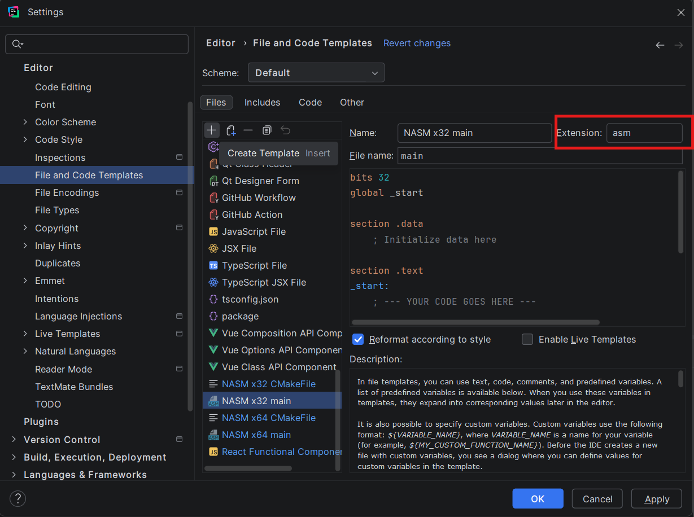

**32-bit body:**
```nasm
bits 32
global _start

section .data
; Initialize data here

section .text
_start:
; --- YOUR CODE GOES HERE ---


    ; --- 32-BIT EXIT SYSTEM CALL ---
    mov eax, 1          ; 32-bit syscall number for sys_exit (1, not 60)
    mov ebx, 0          ; exit code 0
    int 0x80            ; 32-bit kernel interrupt (not 'syscall')
```

**64-bit body:**
```nasm
bits 64
global _start

section .data
; Initialize constants and variables here
; Example: msg db "Hello, Assembly!", 10
; Example: msg_len equ $ - msg

section .bss
; Reserve space for uninitialized data here
; Example: buffer resb 64

section .text
_start:
; --- YOUR CODE GOES HERE ---

    ; --- EXIT SYSTEM CALL ---
    ; This cleanly terminates the program
    mov rax, 60         ; syscall number for sys_exit
    mov rdi, 0          ; exit code 0 (success)
    syscall
```

**Apply** → **OK**.

### 3.3 — Spinning up a new NASM project

CLion's New Project wizard always creates a plain **C Executable** project — it doesn't know about your shiny new NASM templates yet. So the workflow for any new NASM project is:

1. Create a new **C Executable** project the normal way.
2. Delete the auto-generated `main.c` and `CMakeLists.txt` that CLion drops in.
3. Right-click the project root → **New** (or use `File → New`). Scroll past the built-in entries — your `NASM 32 CMakeFile`, `NASM 64 CMakeFile`, `NASM 32 main`, and `NASM 64 main` templates sit at the bottom of the list.

   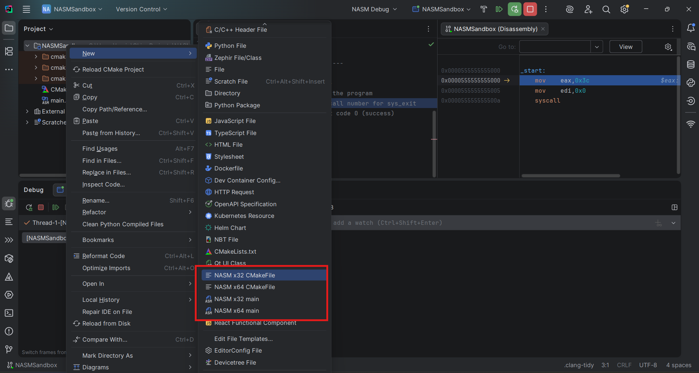

4. Pick the matching pair (e.g. `NASM 64 CMakeFile` + `NASM 64 main`). CLion produces a clean, properly-configured project ready to build.

---

## Day-to-day notes

- **Highlighting isn't perfect.** The Aidan Khoury plugin is the best of the bunch but expect occasional misses on instruction-set extensions and macro-heavy code.
- **Pick the right CMake profile** before hitting Run — the dropdown to the left of the Play button is how you switch between an `x32` and `x64` profile (or anything else you set up).
- **More complex Release/Debug flag setups** belong in the CMake profile's **CMake options** field (Step 1), not in the file template. Keeps the template reusable.

---

## Debugging

If you set up file types per Step 2, debugging works **almost exactly like C/C++**: click the gutter to set a breakpoint, hit **Debug**, step through.

If you skipped Step 2: drop `int3` instructions into your `.asm` source — they trigger as breakpoints when running under the debugger.

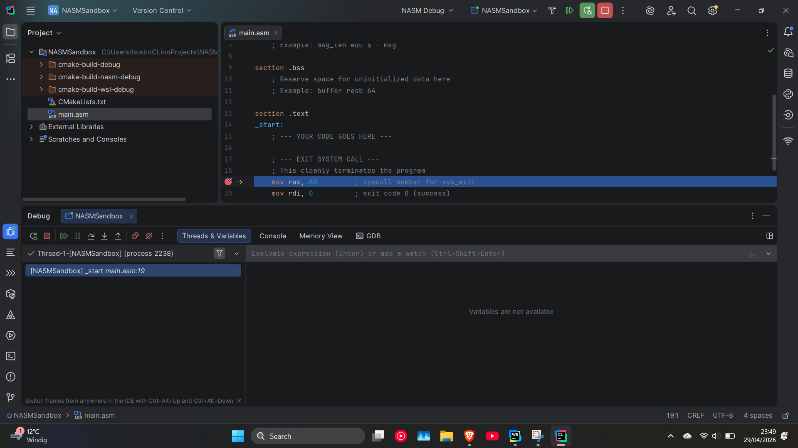

### Watching registers

CLion's default debug view doesn't show CPU registers — you have to drop into the disassembly view first.

**1.** Right-click the call stack in the Debug pane → **Disassemble**.

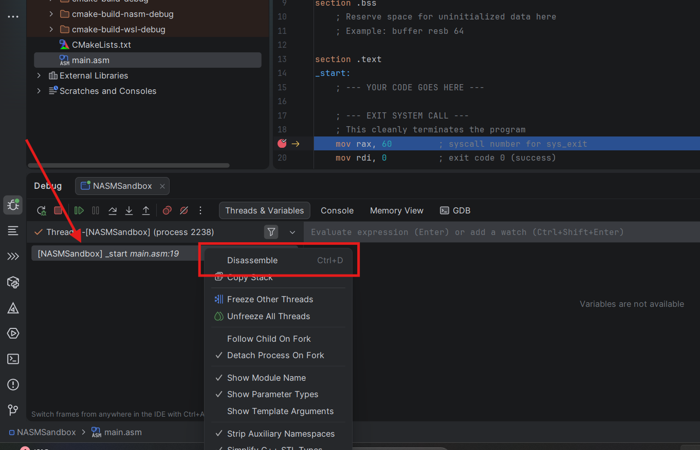

**2.** The disassembly view opens.

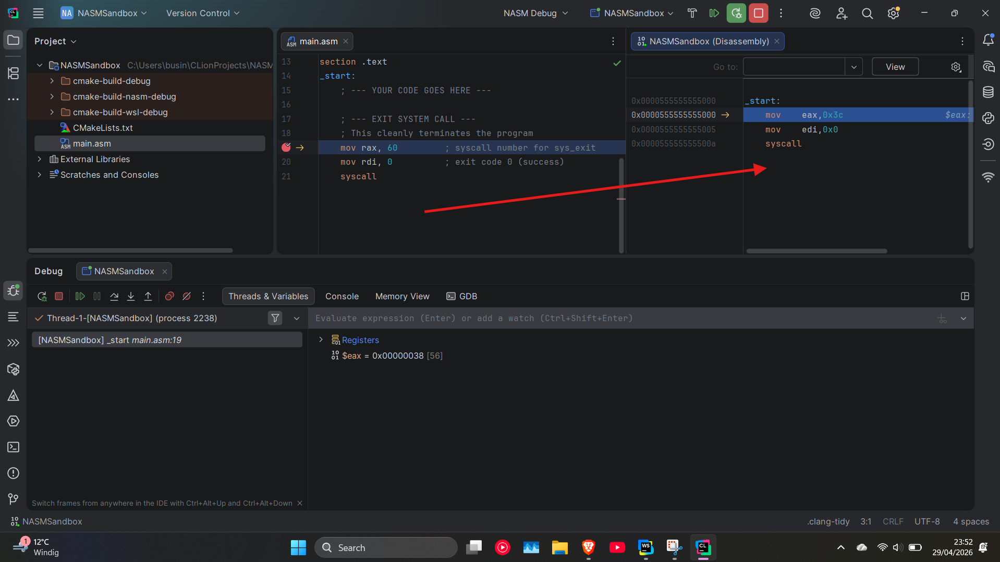

**3.** Switch to the **Threads & Variables** tab and right-click in the body.

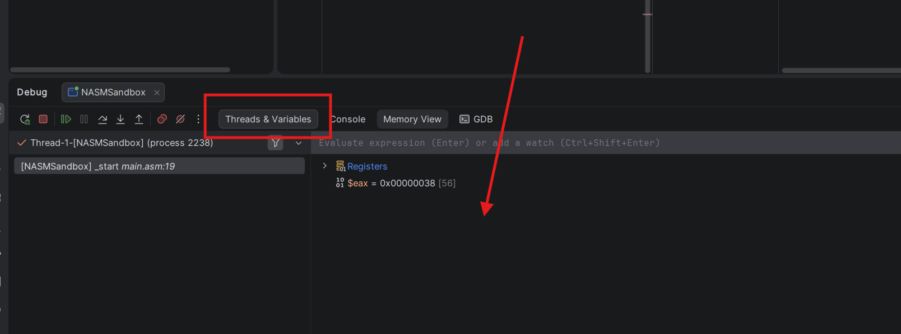

**4.** Pick **Registers → Always show**, then tick the register categories you want (general-purpose, segment, FPU, etc.).

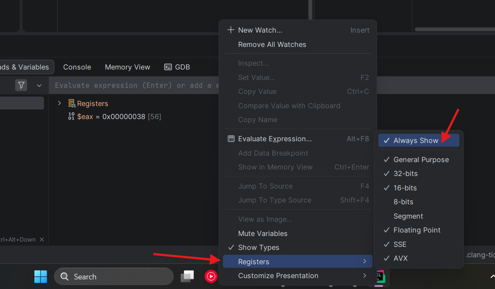

---

## Known issues & caveats

- **`Enhanced NASM Assembly Support` plugin by `aahron` crashes CLion** (verified against CLion 2026.1.1). Use the Aidan Khoury plugin instead.
- **Skipping Step 2 kills inline breakpoints.** Without the `.asm` extension being mapped to Assembly Language File, CLion treats your source as plain text and the debugger silently ignores gutter breakpoints. Use `int3` if you really must skip.
- **`gcc-multilib` is mandatory for the 32-bit path.** Without it, `nasm` produces the object file fine but the linker dies on missing 32-bit crt files.
- **Debugging is a little wonky.** Stepping through pure assembly is fine, but unless set to "show always" the debugger will not show CPU registers unless manually "disassembled". Workaround for that: re-trigger the disassembly via the right-click menu.
- **Highlighting drifts on newer instruction sets.** AVX-512 / SVE / etc. mnemonics aren't always recognized. Code still assembles; the squigglies are cosmetic.

---

## Useful links

**NASM itself**
- [NASM official site](https://www.nasm.us/) — downloads, release notes, and links to everything else.
- [NASM documentation](https://www.nasm.us/docs.php) — the canonical user manual; chapter 2 covers the command-line flags we use in our CMake template.
- [NASM Assembly Language plugin (JetBrains)](https://plugins.jetbrains.com/plugin/9759-nasm-assembly-language) — the syntax-highlighting plugin we install in the prerequisites.

**x86 / x86-64 references**
- [Intel® 64 and IA-32 Architectures Software Developer's Manual](https://www.intel.com/content/www/us/en/developer/articles/technical/intel-sdm.html) — Volume 2 is the instruction-set reference; Volume 3 covers system programming. Hefty but authoritative.
- [System V AMD64 ABI](https://gitlab.com/x86-psABIs/x86-64-ABI) — calling convention, register usage, stack layout. Required reading before writing assembly functions you'll call from C (you'll want this for the upcoming interop guide).
- [x86 Assembly (Wikibooks)](https://en.wikibooks.org/wiki/X86_Assembly) — readable, free, and a far gentler entry point than the Intel SDM.

**Linux syscalls**
- [`syscalls(2)` man page](https://man7.org/linux/man-pages/man2/syscalls.2.html) — full list of Linux syscalls plus the per-architecture register conventions for invoking them.

---

<div align="center">
  <sub>Found a step that drifted out of date? Open a PR — see the <a href="../../README.md#contributions">root README</a>.</sub>
</div>
