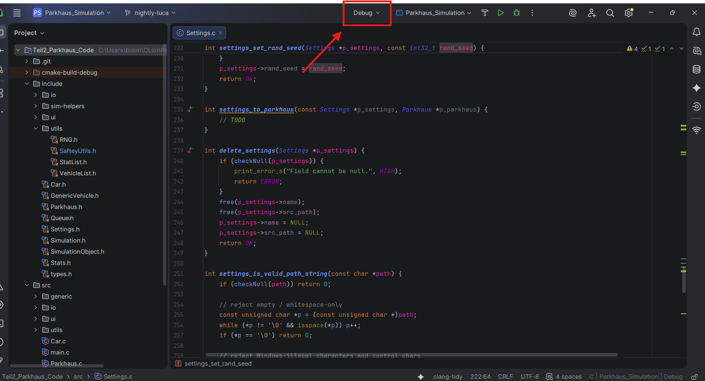
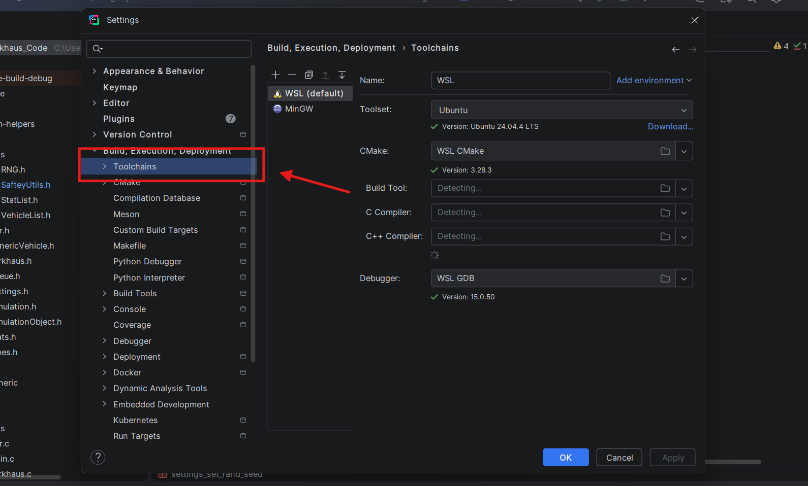
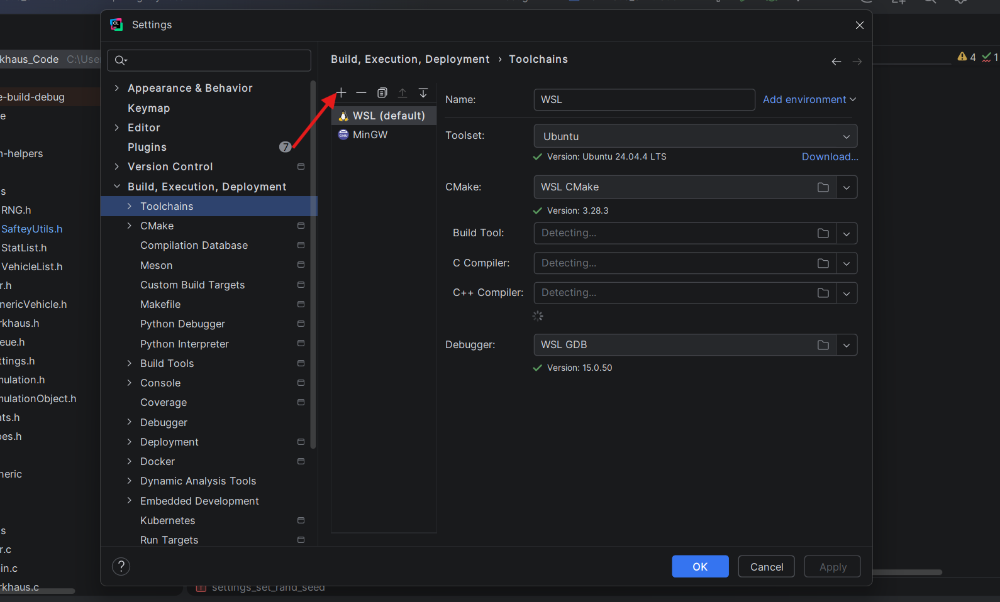
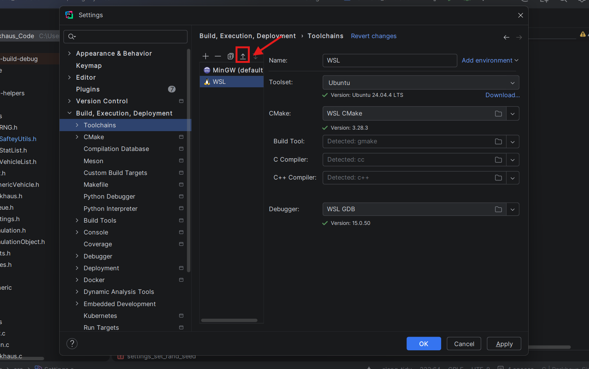
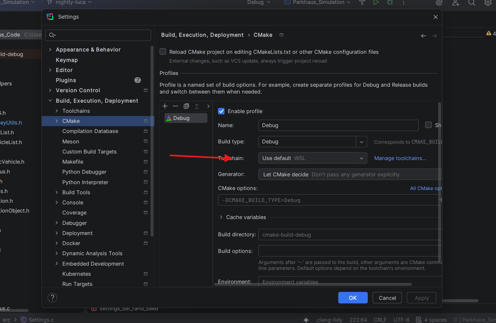

<div align="center">
  <sub><b>You are here:</b> <a href="../../README.md#readme">Home</a> > <a href="../description.md">wsl</a> > guides > 📄 clion-wsl-setup.md</sub>

  <br>
  <h1>CLion + WSL: A C Project Without the Windows Headaches</h1>

  <p>
    <i>Develop a CMake/C project against a real Linux toolchain without leaving CLion.</i>
  </p>

  <p>
    
    
    
  </p>

  <!-- tags:start -->
  <p>
    
    
    
    
  </p>
  <!-- tags:end -->
</div>

<hr>

> *"Sir, I've replaced your Windows compiler with a Linux one. The headaches should be 73% smaller."* — J.A.R.V.I.S. (probably)

*Author: Luca Perri · Last updated: 29/04/2026 · Verified against: CLion 2026.1.1*

## Why this guide exists

Pulling C libraries into a Windows-native CMake project is a special kind of misery: you end up cross-compiling a separate source project, and the moment you push to a Linux build environment (e.g. **GitHub Codespaces**, a CI runner, or a teammate's machine) it stops compiling. During my first semester in uni we had to create a simulation of a parking complex with the requirement being it needs to compile on Codespaces. Real bad time for me and my team, as we all were used to and using CLion on Windows at that time.

There are two practical ways out:

1. **Develop against WSL from CLion** — the path this guide covers in full.
2. **Develop remotely on GitHub Codespaces** — covered briefly at the end.

If "compiles on my machine, compiles in CI" is your goal, **Option 1 is what you want**. WSL gives you a real Ubuntu userland, and CLion natively understands it as a toolchain.
*Time: 20 - 30 Minutes (not accounting for download speed)*
---

## Option 1 — CLion against WSL

### Before you start

You'll need:

- **Windows 10 (build 19041 / version 2004) or newer**, or **Windows 11**. Older builds don't ship WSL2.
- **Hardware virtualization enabled in BIOS/UEFI** — look for "Intel VT-x", "AMD-V", or "SVM Mode". Most modern laptops have it on by default; some desktops don't.
- **Administrator access** on the Windows machine.
- **~2 GB of free disk space** for the Ubuntu image plus build tools.

Close CLion (and VSCode if it's open) before starting — the install asks for a fresh shell, and you'll be restarting WSL part-way through.

### 1. Install WSL

Open **CMD** or **PowerShell** as administrator and run:

```powershell
wsl --install
```

This pulls down WSL2 and Ubuntu (the default distro). **Windows will reboot during the process** — that's expected, your install picks up automatically after you log back in. Once it's done, a console pops up asking for a Linux **username** and **password**. Pick something you'll remember — the password is what `sudo` will ask for later.

> If you already have WSL installed, `wsl -l -v` will show your installed distros. You can skip ahead.

### 2. Install the build toolchain inside WSL

Inside the new WSL shell (the prompt looks roughly like `you@machine:/mnt/c/Users/you$`), install the C build essentials:

```bash
sudo apt update && sudo apt install build-essential cmake doxygen pkg-config
```

What you get:

| Package           | Why                                                       |
| :---              | :---                                                      |
| `build-essential` | gcc, g++, make — the standard C/C++ toolchain             |
| `cmake`           | Build system CLion drives                                 |
| `doxygen`         | Doc generation, if your project uses it                   |
| `pkg-config`      | Lets CMake's `pkg_check_modules` find installed libraries |

> **Trim the list to what you actually use.** Adding more later is just another `sudo apt install`.

### 3. Let WSL play nicely with Windows file paths

By default, WSL doesn't write proper Linux file metadata (permissions, owners) onto files that live on your Windows drive. CMake and git both notice. Fix it:

```bash
sudo nano /etc/wsl.conf
```

Add this block at the top:

```ini
[automount]
options = "metadata,umask=22,fmask=11"
```

Save and exit nano:

- `Ctrl + O`, then `Enter` (write)
- `Ctrl + X` (exit)

### 4. Restart WSL

Back in **CMD/PowerShell** on the Windows side:

```powershell
wsl --shutdown
```

Close every terminal, CMD, and PowerShell window. WSL takes a moment to fully unload.

### 5. Point CLion at the WSL toolchain

Reopen CLion and your project. Then:

**5.1.** Click the **CMake profile dropdown** in the top toolbar.



**5.2.** Click **Edit CMake Profiles...**.

**5.3.** In the settings window, navigate to **Toolchains** in the left sidebar.



**5.4.** Click the **+** above the toolchain list and pick **WSL**.



**5.5.** CLion auto-detects the compilers, CMake, and debugger inside WSL. You don't need to fill anything in. **Move the WSL profile above MinGW** so it becomes the default or leave the current one as default.



**5.6.** Click **Apply** (bottom right).

**5.7.** Switch to **CMake** in the left sidebar.


**5.8.** Set **Toolchain** to **Use Default** (now WSL) — or pick the WSL profile explicitly.



**5.9.** *(Optional)* Set **Generator** to **Let CMake decide**. If your build complains, fall back to **Ninja**.

**5.10.** **Apply** → **OK**. Done.

### Day-to-day notes

- **Switching projects?** Other CMake projects can stay on MinGW — just bump the MinGW profile back to the top of the toolchain list per project or select it specifically in the dropdown.
- **Need a new library?** Install it inside WSL: `sudo apt install <pkg>`. CMake's `find_package` / `pkg_check_modules` will pick it up.
- **Standard library headers** (`<stdio.h>`, `<stdlib.h>`, etc.) work without any extra installs — they're bundled with `build-essential`.
- **Open a WSL shell anytime:** type `wsl` in CMD/PowerShell, or open the CLion terminal (click the down arrow next to Local and select your distro).
- **Performance footgun.** Project files under `/mnt/c/...` (Windows drive) build noticeably slower than files under `\\wsl$\Ubuntu\home\you\...` (the WSL filesystem). The `[automount]` setup in step 3 makes the Windows-side path *workable* — not *optimal*. If builds feel sluggish, move the project into your WSL home directory and open it from there.

### Troubleshooting

- **`wsl --install` says it can't find Ubuntu** — your Windows is probably below build 19041, or the Microsoft Store is blocked by group policy. Try `wsl --install -d Ubuntu` to force the distro by name; if that still fails, install Ubuntu manually from the Microsoft Store.
- **CLion didn't auto-detect compilers in step 5.5.** The WSL toolchain pane is empty or shows red errors. Most often this means `build-essential` was never installed inside WSL (or installed under a different distro). Re-run step 2, then back in CLion's Toolchains pane click the WSL profile and hit the refresh icon to re-scan.
- **`/etc/wsl.conf` changes didn't take effect.** `wsl --shutdown` only works if every WSL window — including CLion's WSL terminal — is closed first. Close everything, run shutdown again, reopen.
- **CLion compiles but the binary won't run.** You're probably trying to run a Linux ELF on Windows or vice versa. Check that your Run/Debug configuration is using the WSL profile, not MinGW.

---

## Option 2 — GitHub Codespaces (Remote Development)

Sometimes you don't want WSL at all and would rather just SSH into a Linux box in the cloud. Codespaces works for that, with caveats:

- **You have a finite monthly Codespaces budget.** Long sessions burn it.
- **CLion's remote-dev path is heavier than VSCode's** — it uploads a backend IDE to the container.

If you want this anyway:

### A. VSCode (easiest path)

1. Install the **GitHub Codespaces** extension from the VSCode marketplace.
2. Bottom-left green icon (Remote-Window) → **Codespaces: Connect to Codespace**, or hit `F1` and type the same.
3. Pick your repo. VSCode opens a window connected directly to the Codespace's Ubuntu environment.

If your project depends on any package, run `sudo apt install <package` in the Codespace terminal once — or, better, declare it in `.devcontainer/devcontainer.json` so every new Codespace has it pre-installed.

### B. CLion + Codespaces — *no longer a real option*

There used to be a **GitHub Codespaces** plugin for JetBrains Gateway that let CLion attach to a Codespace as a thin client. **That plugin has been discontinued** and there is no first-party replacement — guides on the internet that walk you through installing it are stale.

If you want a JetBrains-flavored remote-dev experience today, your realistic choices are:

- **Use VSCode for Codespaces specifically** (Section A above). It's the one supported path.
- **Use JetBrains Gateway against a regular SSH-reachable Linux host** that you provision yourself (a cloud VM, a homelab box, etc.). Gateway's *SSH* connection is alive and well — it just doesn't talk to Codespaces anymore.

In short: if your team is committed to Codespaces, use VSCode. If your team is committed to CLion, use **Option 1 (WSL)** or self-host a remote box for Gateway.

---

## Golden rules (regardless of which path you pick)

- **Never hard-code Windows paths in `CMakeLists.txt`.** No `C:\libs`, no `D:\sdks`. Always go through `find_package` or `pkg_check_modules` so the build resolves on any Linux environment too.
- **Install libraries in WSL or in the Codespace**, not on Windows-side. The Linux toolchain can't see Windows-side installs.
- **Codespaces is Linux end-to-end.** Even though the source files may live on a Windows path locally, the Codespace runs them in a Linux filesystem — line endings, file permissions, and case-sensitivity all behave Linux-style.
- **Stop your Codespace when you're done.** Idle Codespaces still bill against your minutes.

---

## Fact-check & caveats

A few things worth flagging — most are minor, but they matter if you're on an older system or a newer CLion build:

- **WSL2 is a real lightweight VM**, running on Hyper-V — not just an emulation layer. WSL1 was the translation-layer flavor; modern `wsl --install` defaults to WSL2.
- **`umask=22,fmask=11`** in `/etc/wsl.conf` are parsed as octal (`022` and `011`). This is the form Microsoft's own docs use; both `22` and `0022` work.
- **`ninja.exe` in CLion's Generator dropdown** is just CLion's Windows-side label. With a WSL toolchain, the Linux `ninja` binary is what actually runs — the label is a UI quirk, not a problem.
- **The JetBrains GitHub Codespaces plugin is discontinued** — older guides telling you to install it from the marketplace are no longer accurate. JetBrains Gateway itself still works fine for remote development over SSH; it just doesn't have a first-party Codespaces integration anymore.
- **Plugin marketplace links rot.** Even when a plugin is alive, always search inside the JetBrains plugin browser rather than trusting a hard-coded URL — IDs change.

---

## Useful links

**WSL itself**
- [WSL documentation](https://learn.microsoft.com/en-us/windows/wsl/) — Microsoft's canonical reference for everything WSL.
- [WSL installation guide](https://learn.microsoft.com/en-us/windows/wsl/install) — covers prerequisites, manual installs, and getting WSL onto Windows builds older than 19041.
- [`wsl.conf` advanced settings](https://learn.microsoft.com/en-us/windows/wsl/wsl-config) — every option for the file we touched in step 3, including `automount` flags beyond the three we used.
- [WSL on GitHub](https://github.com/microsoft/WSL) — issue tracker if you hit a bug worth reporting.

**CLion & CMake**
- [Use WSL as a development environment in CLion](https://www.jetbrains.com/help/clion/how-to-use-wsl-development-environment-in-product.html) — JetBrains' official write-up if step 5 looks different on your CLion version.
- [CMake documentation](https://cmake.org/documentation/) — for when your `CMakeLists.txt` outgrows the basics.

---

<div align="center">
  <sub>Found a step that drifted out of date? Open a PR — see the <a href="../../README.md#contributions">root README</a>.</sub>
</div>
